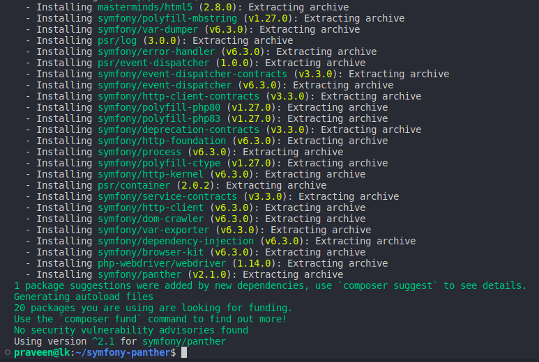

# Symfony Panther

```
composer require --dev symfony/panther
```


25 packages were installed started from **masterminds/html5** including **symfony/browser-kit** and **php-webdriver/webdriver**.

# Panther


A browser testing and web scraping library for PHP and Symfony

Panther is a convenient standalone library to scrape websites and to run end-to-end tests using real browsers.

Panther is super powerful. It leverages the W3C's WebDriver protocol to drive native web browsers such as Google Chrome and Firefox.

https://github.com/symfony/panther